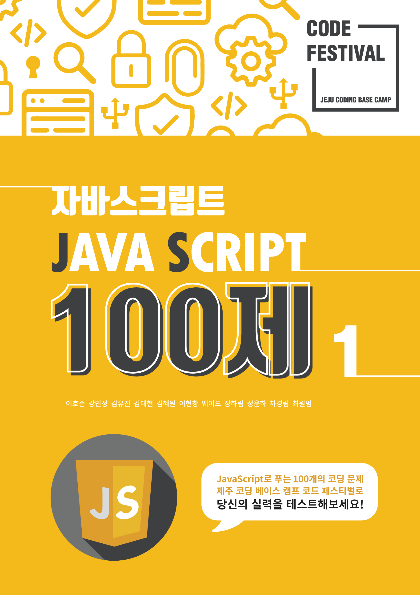

   
  
  <h1>자바스크립트 100제</h1>

[🔗 자바스크립트 100제 링크 바로가기 Click!](https://www.notion.so/JS-100-94d97d294dd14c9b911a02c840fa9f2d) 👈

> 새 창 열기 방법 : CTRL+click (on Windows and Linux) | CMD+click (on MacOS)

 

## 📅 스터디 진행 일정표

- **박정환**

|   날짜 (요일)    |      분량       | 수행 여부 |
| :--------------: | :-------------: | :-------: |
| 2021.07.27. (화) | 문제1 ~ 문제10  |     O     |
| 2021.07.28. (수) | 문제11 ~ 문제20 |     O     |
| 2021.07.29. (목) | 문제21 ~ 문제30 |     O     |
| 2021.07.30. (금) | 문제31 ~ 문제40 |     O     |
| 2021.08.01. (토) | 문제41 ~ 문제45 |     O     |
| 2021.08.02. (일) | 문제46 ~ 문제50 |     -     |

- **강바울**

|   날짜 (요일)    |      분량       | 수행 여부 |
| :--------------: | :-------------: | :-------: |
| 2021.07.27. (화) | 문제1 ~ 문제10  |     -     |
| 2021.07.28. (수) | 문제11 ~ 문제20 |     -     |
| 2021.07.29. (목) | 문제21 ~ 문제30 |     -     |
| 2021.07.30. (금) | 문제31 ~ 문제40 |     -     |
